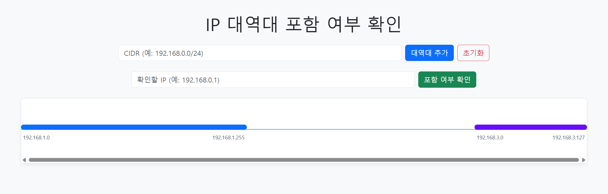
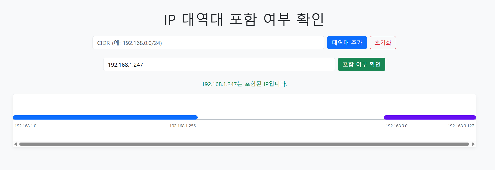
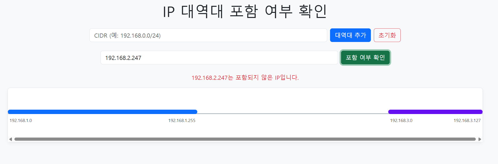

# IPChecker
아이피가 특정 범위에 포함되는지 빠르게 판단하기 위한 모듈

[개발 일지 [클릭]](dev_log.md)

아이피 대역을 정수로 변환한 뒤, 중복되는 대역대는 병합하여 TreeMap에 시작 지점을 키로 하여 저장.</br>
이후, 포함 여부를 확인할 아이피에 대해 floorKey를 이용해 가장 가까운 시작 지점을 가진 대역을 찾고, 해당 대역대 범위에 아이피가 포함되는지 확인
(시간 복잡도 - O(logN))

### 대역대 추가 메소드 (중복되는 대역대 병합 진행)

```
  public boolean addRange(String ipRange) {
    SubnetUtils subnetUtils = new SubnetUtils(ipRange);
    // 네트워크 주소, 브로드 캐스트 주소도 포함하여 검사
    subnetUtils.setInclusiveHostCount(true);
    SubnetInfo info = subnetUtils.getInfo();
    String lowAddress = info.getLowAddress();
    String highAddress = info.getHighAddress();
    Long rangeStart = ipToLong(lowAddress);
    Long rangeEnd = ipToLong(highAddress);
    if (rangeStart == null || rangeEnd == null) {
      return false;
    }
    Map.Entry<Long, Long> lowerEntry = ipRangeMap.floorEntry(rangeStart);
    Map.Entry<Long, Long> higherEntry = ipRangeMap.ceilingEntry(rangeStart);

    long newStart = rangeStart;
    long newEnd = rangeEnd;

    /*
     * 앞쪽 대역대와 병합 가능 여부 확인
     * 현재 대역대의 시작점보다 앞쪽 대역대의 종료점이 더 클 경우 둘 병합
     */
    if (lowerEntry != null && lowerEntry.getValue() >= rangeStart - 1) {
      newStart = Math.min(lowerEntry.getKey(), newStart);
      newEnd = Math.max(lowerEntry.getValue(), newEnd);
      ipRangeMap.remove(lowerEntry.getKey());
    }

    /*
     * 뒤쪽 대역대와 병합 가능 여부 확인
     * 현재 대역대의 종료점보다 뒤쪽 대역대의 시작점이 더 작을 경우 둘 병합
     */
    if (higherEntry != null && higherEntry.getKey() <= rangeEnd + 1) {
      newStart = Math.min(higherEntry.getKey(), newStart);
      newEnd = Math.max(higherEntry.getValue(), newEnd);
      ipRangeMap.remove(higherEntry.getKey());
    }

    ipRangeMap.put(newStart, newEnd);

    return true;
  }

```

### 아이피 포함 여부 확인 메소드

```
  public boolean isIncludeIP(String ip) {

    Long ipLong = ipToLong(ip);
    if (ipLong == null) {
      return false;
    }

    Map.Entry<Long, Long> entry = ipRangeMap.floorEntry(ipLong);
    return entry != null && ipLong >= entry.getKey() && ipLong <= entry.getValue();
  }

```

## 화면 구성

### 초기 화면


### 아이피 대역대 시각화




### 아이피 대역대 포함 여부 확인 </br>

아이피 포함 시 </br>



아이피 미포함 시</br>


