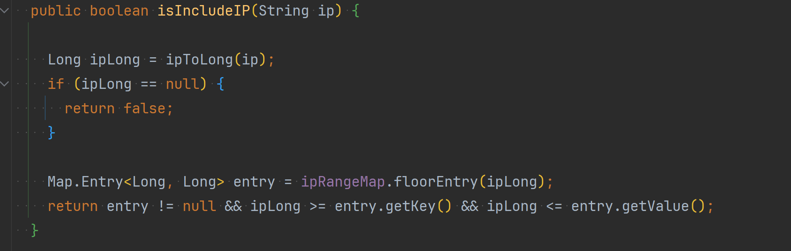

# IPChecker
아이피가 특정 범위에 포함되는지 빠르게 판단하기 위한 모듈

apache-james의 NetMatcher을 통해 확인하고 있던 아이피의 대역대 포함 여부를 빠르게 확인하기 위해 개발

<b>기존 방식</b> 
저장하고 있는 대역대 List를 순서대로 확인하여 포함여부 확인 (시간 복잡도 - O(n))

<b>개선 후</b> 
아이피 대역을 정수로 변환한 뒤, TreeMap에 시작 지점을 키로 하여 저장. 
이후, 포함 여부를 확인할 아이피에 대해 floorKey를 이용해 가장 가까운 시작 지점을 가진 대역을 찾고, 해당 범위에 포함되는지 검사하도록 개선
(시간 복잡도 - O(logN))

[개발 일지 [클릭]](dev_log.md)