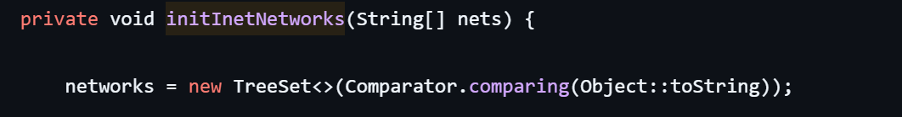
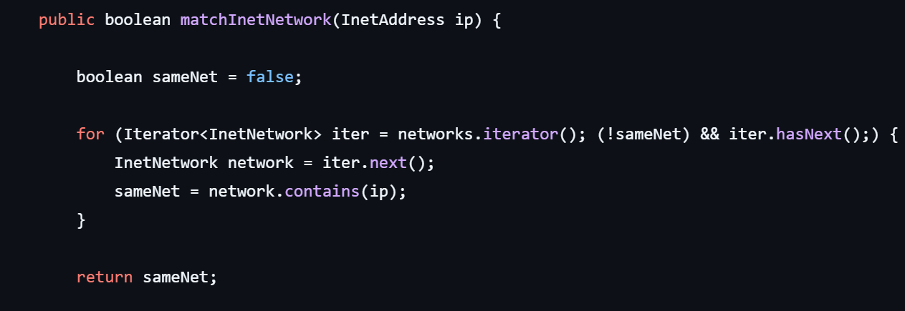
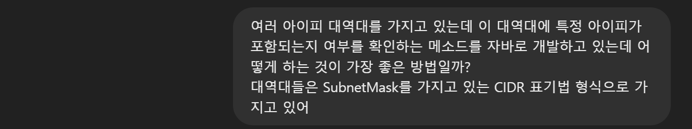
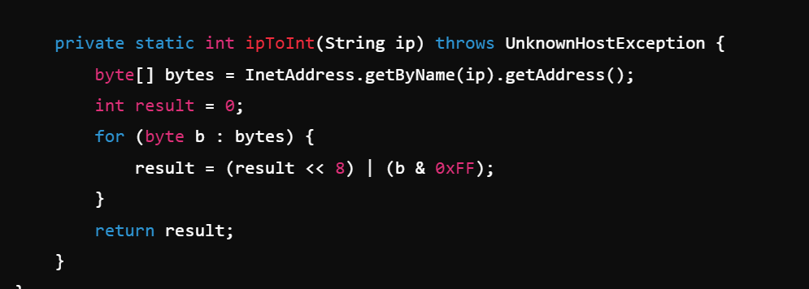

# IPChecker
아이피가 특정 범위에 포함되는지 빠르게 판단하기 위한 모듈

## 개발 동기
기존 회사에서 아이피가 범위에 포함되는지 여부를 apache-james의 NetMatcher을 통해 확인하고 있었다.
(https://github.com/apache/james-project/blob/master/server/dns-service/dnsservice-library/src/main/java/org/apache/james/dnsservice/library/netmatcher/NetMatcher.java)

해당 클래스에서는 아이피 범위(Subnet Mask)들을 SortedSet(TreeSet)에 저장하고 있었다.



허나 아이피는 그저 작은 숫자가 먼저 오도록 정렬되고 있었고 포함 여부를 확인하는 메소드에서도 별 다른 활용을 하지 않고 있었다.


따라서 그냥 HashSet으로 변경하여 성능을 좀 더 올려볼까라고 생각하였으나 정렬을 활용하면 더 좋은 성능을 끌어낼 수 있지 않을까 라는 생각이 들어 새로운 방법을 찾기 시작하였다.

## 개발 과정
### GPT와의 협업
우선 '라이브러리에서 TreeSet을 사용하는 이유가 있지 않을까?'해서 이를 활용할 수 있는 방법에 대해 GPT에게 물어보았다.</br>
GPT는 작은 대역대부터 검사 후 큰 대역대를 검사하라 하였으나 큰 성능상의 이점은 없다 판단하여 새로운 프롬프트로 질문을 다시 시작하였다.



이때 GPT는 아이피 포함 여부를 확인해주는 코드를 작성해주었는데 그 중에서 눈에 띄는 부분은 ipToInt라는 IP를 int로 변환해주는 메소드였다.


<details>
<summary>GPT가 작성한 전체 코드</summary>

```
import java.net.InetAddress;
import java.net.UnknownHostException;
import java.util.ArrayList;
import java.util.List;

public class IPSubnetChecker {

    // CIDR 범위를 나타내는 클래스
    static class Subnet {
        private final int subnetAddress;
        private final int subnetMask;

        public Subnet(String cidr) throws UnknownHostException {
            String[] parts = cidr.split("/");
            String ip = parts[0];
            int prefixLength = Integer.parseInt(parts[1]);

            this.subnetAddress = ipToInt(ip);
            this.subnetMask = (0xFFFFFFFF << (32 - prefixLength));
        }

        public boolean contains(String ip) throws UnknownHostException {
            int ipInt = ipToInt(ip);
            return (ipInt & subnetMask) == (subnetAddress & subnetMask);
        }

        private static int ipToInt(String ip) throws UnknownHostException {
            byte[] bytes = InetAddress.getByName(ip).getAddress();
            int result = 0;
            for (byte b : bytes) {
                result = (result << 8) | (b & 0xFF);
            }
            return result;
        }
    }

    public static void main(String[] args) throws UnknownHostException {
        List<Subnet> subnets = new ArrayList<>();
        subnets.add(new Subnet("192.168.1.0/24"));
        subnets.add(new Subnet("10.0.0.0/8"));

        String testIp = "192.168.1.100";

        for (Subnet subnet : subnets) {
            if (subnet.contains(testIp)) {
                System.out.println(testIp + " is in " + subnet);
            }
        }
    }
}
```
</details>

현재 GPT의 코드에서는 대역대에 적용되어 있는 서브넷 마스크를 아이피에도 적용하여 둘이 일치하는지 확인하는 내용이었는데<br>
이를 보고 만일 대역대를 숫자 범위로 변환하고 이분 탐색을 활용한다면 더 빠르게 포함 여부를 확인할 수 있지 않을까? 라는 생각을 하게 되었다.