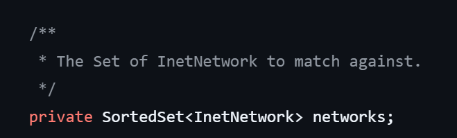
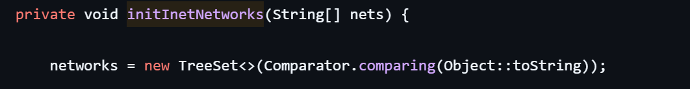
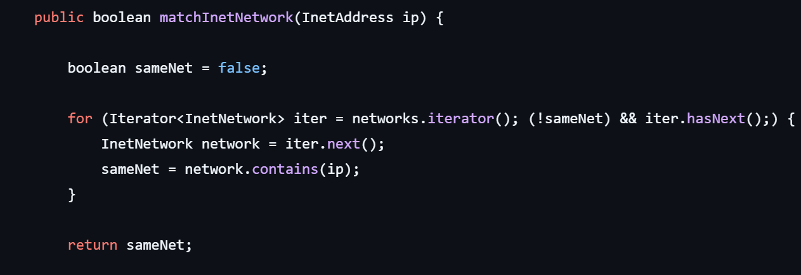
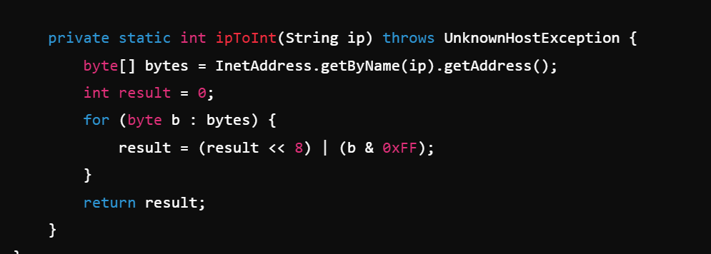

# IPChecker
아이피가 특정 범위에 포함되는지 빠르게 판단하기 위한 모듈

## 개발 동기
기존 회사에서 아이피가 범위에 포함되는지 여부를 apache-james의 NetMatcher을 통해 확인하고 있었다.
(https://github.com/apache/james-project/blob/master/server/dns-service/dnsservice-library/src/main/java/org/apache/james/dnsservice/library/netmatcher/NetMatcher.java)

<b>해당 클래스에서는 아이피 범위(Subnet Mask)들을 SortedSet(TreeSet)에 저장하고 있었다.</b> </br>




허나 아이피는 그저 작은 숫자가 먼저 오도록 정렬되고 있었고 포함 여부를 확인하는 메소드에서도 별 다른 활용을 하지 않고 있었다.



따라서 그냥 HashSet으로 변경하여 성능을 좀 더 올려볼까라고 생각하였으나 정렬을 활용하면 더 좋은 성능을 끌어낼 수 있지 않을까 라는 생각이 들어 새로운 방법을 찾기 시작하였다.

## 개발 과정

### 기능 설계
우선 '라이브러리에서 TreeSet을 사용하는 이유가 있지 않을까?'해서 이를 활용할 수 있는 방법에 대해 GPT에게 물어보았다.</br>
GPT가 제시한 방법은 String으로 정렬된 TreeMap의 대역대들 중 아이피보다 작은 대역대들만 탐색하는 것이었다.

<details>
<summary>GPT가 작성했던 코드</summary>

```
    public boolean isIpInSubnet(String ip) {
        Inet4Address inetAddress = (Inet4Address) InetAddresses.forString(ip);
        InetNetwork ipSubnet = InetNetwork.fromCidr(ip + "/32");

        // headSet(ipSubnet, true)로 ip보다 작은 서브넷들을 가져오기
        NavigableSet<InetNetwork> possibleSubnets = subnets.headSet(ipSubnet, true);

        // for 문을 활용하여 서브넷이 포함하는지 확인 (즉시 반환)
        for (InetNetwork subnet : possibleSubnets) {
            if (subnet.contains(inetAddress)) {
                return true; // 서브넷 내 포함되면 즉시 true 반환
            }
        }

        return false; // 포함된 서브넷이 없으면 false 반환
    }
```
</details>

이렇게 되었을 경우에 확인해야하는 대역대 범위를 줄일 수 있어 탐색 속도를 더 빠르게 할 수 있으나</br>
'192.168.1.247/8'와 같은 대역대가 들어있을 경우 192.168.1.10과 같은 아이피를 정상적으로 탐지하지못한다.</br>
<b>(글을 작성하면서 알게된 건데 이 표현은 서브넷 마스크 문법에 맞지 않는 표현이었다.)</b>

그리하여 나는 새로운 프롬프트로 질문을 다시 시작하였다.


이때 GPT는 아이피 포함 여부를 확인해주는 코드를 작성해주었는데 그 중에서 눈에 띄는 부분은 ipToInt라는 IP를 int로 변환해주는 메소드였다.



<details>
<summary>GPT가 작성한 전체 코드</summary>

```
import java.net.InetAddress;
import java.net.UnknownHostException;
import java.util.ArrayList;
import java.util.List;

public class IPSubnetChecker {

    // CIDR 범위를 나타내는 클래스
    static class Subnet {
        private final int subnetAddress;
        private final int subnetMask;

        public Subnet(String cidr) throws UnknownHostException {
            String[] parts = cidr.split("/");
            String ip = parts[0];
            int prefixLength = Integer.parseInt(parts[1]);

            this.subnetAddress = ipToInt(ip);
            this.subnetMask = (0xFFFFFFFF << (32 - prefixLength));
        }

        public boolean contains(String ip) throws UnknownHostException {
            int ipInt = ipToInt(ip);
            return (ipInt & subnetMask) == (subnetAddress & subnetMask);
        }

        private static int ipToInt(String ip) throws UnknownHostException {
            byte[] bytes = InetAddress.getByName(ip).getAddress();
            int result = 0;
            for (byte b : bytes) {
                result = (result << 8) | (b & 0xFF);
            }
            return result;
        }
    }

    public static void main(String[] args) throws UnknownHostException {
        List<Subnet> subnets = new ArrayList<>();
        subnets.add(new Subnet("192.168.1.0/24"));
        subnets.add(new Subnet("10.0.0.0/8"));

        String testIp = "192.168.1.100";

        for (Subnet subnet : subnets) {
            if (subnet.contains(testIp)) {
                System.out.println(testIp + " is in " + subnet);
            }
        }
    }
}
```
</details>

이를 보고 <b>'만일 대역대를 숫자 범위로 변환하여 중복되는 범위를 병합한다면 String으로 정렬하였을 때의 문제점을 해결할 수 있지 않을까?'</b> 라는 생각을 하게 되어 개발을 시작하게 되었다.

### TDD(Test Driven Development)
TDD로 진행하여 기본적인 기능인 "대역대 추가", "아이피 포함 여부 확인" 테스트부터 작성하여 진행하였다.

여기서 바로 문제가 발생하였는데, 등록된 아이피 대역대 정보는 클래스 내부에서 포함 여부를 확인하기 위해서만 사용되는 데이터이므로 외부에 노출될 필요가 없는 데이터라 생각하여 private으로 되어 있었다.

허나 이로 인해 테스트 메소드에서 아이피 대역대 추가 후 확인하는 것이 불가능하여 어떻게 해결 할 지 방안에 대해 고민하던 중</br>
<b>만일 정상적으로 대역대가 추가되었다면 해당 대역대에 포함되는 아이피가 포함 여부 확인 메소드에서 true가 반환</b> 되어야 한다 생각하여</br>
대역대 추가 테스트는 정상적으로 실행되는지만 확인 후</br> 
실제 Map에 정상적으로 추가되었는지 여부는 isInclude 메소드를 통해 확인하고자 아래와 같이 테스트 코드를 작성하였다. 

```
  @Test
  @DisplayName("대역대 추가 테스트")
  public void addRangeTest() {

    // arrange
    String ipRange = "192.168.1.0/24";

    // act
    boolean result = ipRangeCheckService.addRange(ipRange);

    // assert
    assertThat(result).isTrue();
  }

  /**
   * 대역대가 추가되어 있을 경우 대역대에 포함되는 아이피의 포함 여부 정상적으로 반환되는지 확인
   */
  @Test
  @DisplayName("아이피 포함 여부 확인 테스트")
  public void isIncludeIPTest() {
    // arrange
    String ipRange = "192.168.1.0/24";
    ipRangeCheckService.addRange(ipRange);
    String ip = "192.168.1.247";

    // act
    boolean result = ipRangeCheckService.isIncludeIP(ip);

    // assert
    assertThat(result).isTrue();
  }
```


테스트 코드를 통해 기본적인 기능을 만든 후 이제 중복되는 대역대에 대한 처리가 필요하였다.

### 중복되는 대역대 병합

서브넷 마스크로 분리된 아이피 대역대들은 하나의 큰 범위를 비트수에 따라 쪼개 놓은 것이다. 모든 대역대는 특정 지점에서 시작하고 특정 지점에서 끝나게 된다.


이러한 서브넷 마스크의 특성으로 인해 아래 그림처럼 일부만 겹치는 경우는 발생할 수 없다.


따라서 대역대 추가 시 중복되는 범위 병합 여부 확인을 위해 테스트해야할 케이스는 아래와 같다.

1. 두 대역대 시작 지점이 동일한 경우
- (기존 < 추가)
    

- (기존 > 추가)
    

2. 두 대역대 끝 지점이 동일한 경우
- (기존 < 추가)
    

- (기존 > 추가)
    

3. 기존 대역대가 추가 대역대를 포함하는 경우
    

4. 추가 대역대가 기존 대역대를 포함하는 경우
    

총 6개의 테스트 케이스를 작성하였고, 이 케이스들을 모두 통과할 수 있도록 아이피 대역대 추가 기능을 구현하였다.

### 화면 추가
대역대를 시각화한다면 추후 사용자에게 왜 해당 아이피가 포함되어있는 것으로 판단되었는지 쉽게 이해시킬 수 있겠다는 생각이 들어 프론트엔드 구성을 시작하게 되었다.

대역대의 경우 이미 서버에서 Long값으로 가지고 있으니 이를 프론트에서 불러와 다시 IP로 변환하면 좋겠다는 생각이 들었고</br>
해당 내용을 바탕으로 어떻게 구성하면 좋을지 GPT에게 물어보았다.

</br>


GPT가 어느정도 기본은 작성해주었으나 디테일이 많이 부족하였고, 정상적으로 동작하지 않는 부분도 많았다.
다행이 프론트에 대한 기본적인 이해는 있어 충분히 해결할 수 있었고, 아래와 같이 기본적인 화면을 구성할 수 있었다.


### 누락된 테스트 케이스 발생
화면을 구성한 후 이런 저런 데이터를 넣어보다, 초기에 테스트 케이스 고려 시 놓친 부분이 있다는 것을 깨닫게 되었다.

두 대역대를 등록하고 앞쪽의 대역대에 이미 포함되는 대역대를 추가할 떄 발생하는 문제였는데, 아래와 같이 테스트하다 알게 되었다.

1. "192.168.1.0/24"와 "192.168.5.0/24"를 등록
    

2. "192.168.1.0/24"에 포함되는 "192.168.1.247/31" 추가
    
    (192.168.1.0/24에 이미 포함되어 있으므로 시각화된 대역대는 변화가 없어야하는데 비정상적으로 병합되는 모습)

이를 해결하기 위해 해당 케이스를 테스트 코드로 작성해주었고, 서비스 코드를 확인해보았는데 여기에 문제점이 있었다.


추가되는 대역대의 뒤쪽 대역대와 병합 가능 여부를 확인할 때 뒤쪽 대역대의 시작점(higherEntry의 key)과 추가되는 대역대의 종료점(rangeEnd)을 비교하여 병합 여부를 판단해야 하는데</br>
현재는 뒤쪽 대역대의 종료점(higherEntry의 value)과 추가되는 대역대의 시작점(rangeStart)와 비교하고 있어 문제가 발생하는 것이었다.</br>

정상적으로 비교하도록 수정하니 테스트는 통과되었다.

허나 서비스 로직을 보면 우리는 대역대 추가 로직에서 앞의 대역대와의 병합, 뒤의 대역대와의 병합 총 두번의 병합이 이루어진다.

```
    // 앞쪽 대역대와의 병합
    if (lowerEntry != null && lowerEntry.getValue() >= rangeStart - 1) {
      newStart = Math.min(lowerEntry.getKey(), newStart);
      newEnd = Math.max(lowerEntry.getValue(), newEnd);
      ipRangeMap.remove(lowerEntry.getKey());
    }

    // 뒤쪽 대역대와의 병합
    if (higherEntry != null && higherEntry.getKey() <= rangeEnd + 1) {
      newStart = Math.min(higherEntry.getKey(), newStart);
      newEnd = Math.max(higherEntry.getValue(), newEnd);
      ipRangeMap.remove(higherEntry.getKey());
    }
```

따라서 이를 고려하면 두번의 병합이 모두 정상적으로 동작할 수 있는지 여부는 테스트할 필요가 있다는 생각이 들어 아래 케이스를 추가하였고 정상적으로 통과되는 것을 확인했다.
 
- 기존 두개의 대역대 사이에 대역대가 추가되는 경우(병합이 앞뒤 모두 이루어지는 경우)


